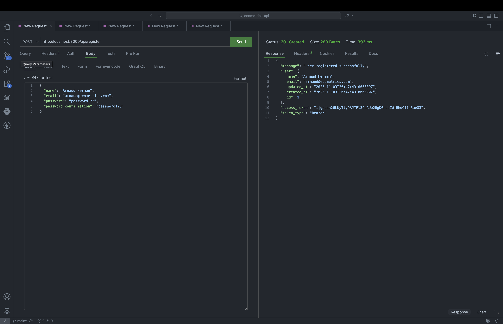
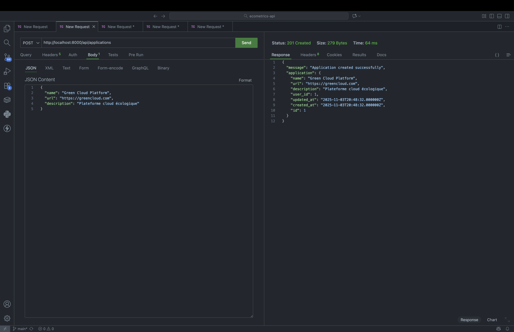
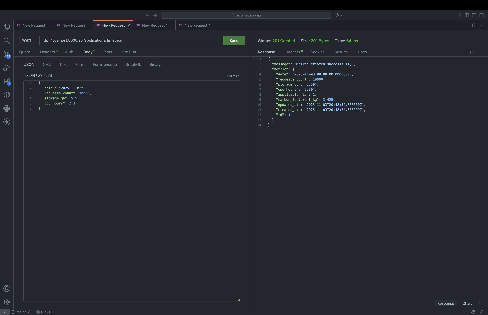
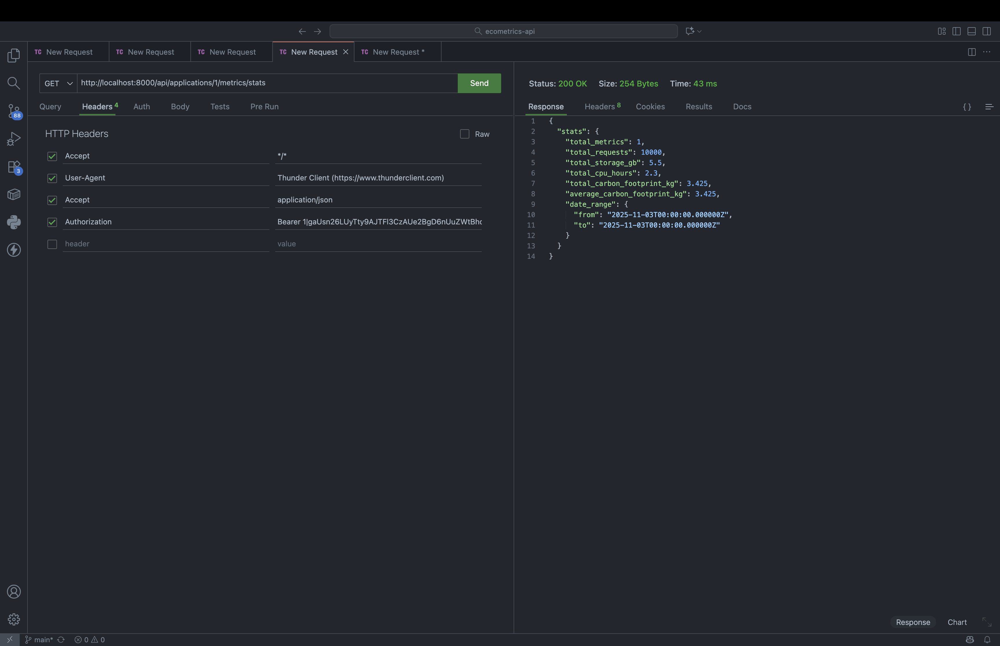
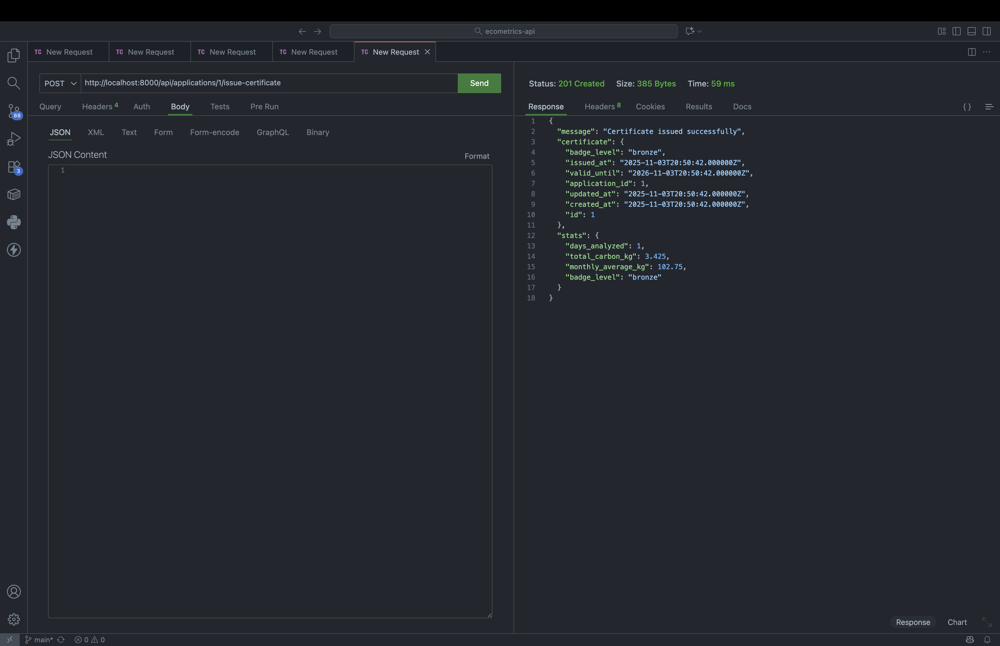

# 🌱 EcoMetrics API

> API REST pour calculer et suivre l'empreinte carbone des applications web

[](https://github.com/arnaudherman/ecometrics-api)
[](https://laravel.com)
[](https://php.net)
[](https://postgresql.org)
[](LICENSE)

---

## 📖 Table des matières

- [Concept](#-concept)
- [Fonctionnalités](#-fonctionnalités)
- [Stack technique](#-stack-technique)
- [Installation](#-installation)
- [Utilisation](#-utilisation)
- [Screenshots](#-screenshots)
- [API Endpoints](#-api-endpoints)
- [Tests](#-tests)
- [Architecture](#-architecture)
- [Roadmap](#-roadmap)
- [Contribution](#-contribution)

---

## 💡 Concept

**EcoMetrics** permet aux développeurs et entreprises de mesurer l'impact environnemental de leurs applications web en se basant sur des métriques d'usage réelles.

L'API calcule automatiquement l'empreinte carbone basée sur :
- 📊 **Nombre de requêtes HTTP** (charge serveur)
- 💾 **Stockage utilisé** (consommation disque)
- ⚡ **Temps CPU consommé** (traitement)

Chaque application peut obtenir un **certificat carbone** avec un badge de performance.

---

## ✨ Fonctionnalités

### 🎯 Gestion des applications
- Créer et gérer plusieurs applications web
- Suivre les métriques par application
- Isolation multi-tenant (chaque user voit ses apps)

### 📊 Suivi des métriques
- Enregistrement quotidien des métriques
- Calcul automatique du carbon footprint
- Agrégations et statistiques
- Prévention des doublons par date

### 🏆 Système de badges
Certification basée sur l'empreinte carbone totale :

| Badge | Seuil | Emoji |
|-------|-------|-------|
| **Platinum** | < 10 kg CO₂ | 🏆 |
| **Gold** | 10-25 kg CO₂ | 🥇 |
| **Silver** | 25-50 kg CO₂ | 🥈 |
| **Bronze** | > 50 kg CO₂ | 🥉 |

### 🔐 Sécurité
- Authentification JWT via Laravel Sanctum
- Policies d'autorisation (chaque user accède uniquement à ses données)
- Validation stricte des entrées
- Rate limiting

---

## 🛠 Stack technique

### Backend
- **Framework** : Laravel 11
- **Language** : PHP 8.3
- **Base de données** : PostgreSQL 16
- **Cache** : Redis 7
- **Auth** : Laravel Sanctum (API Tokens)

### DevOps
- **Containerisation** : Docker + Docker Compose
- **Tests** : PHPUnit (28 tests, 94 assertions)
- **CI/CD Ready** : GitHub Actions compatible

### Architecture
- **Pattern** : MVC (Model-View-Controller)
- **ORM** : Eloquent
- **API** : RESTful JSON
- **Validation** : Form Requests

---

## 🚀 Installation

### Prérequis

- Docker Desktop installé
- Git

### Étapes

```bash
# 1. Cloner le repository
git clone https://github.com/arnaudherman/ecometrics-api.git
cd ecometrics-api

# 2. Copier le fichier d'environnement
cp .env.example .env

# 3. Lancer les containers Docker
docker-compose up -d

# 4. Installer les dépendances
docker-compose exec app composer install

# 5. Générer la clé d'application
docker-compose exec app php artisan key:generate

# 6. Lancer les migrations
docker-compose exec app php artisan migrate

# 7. (Optionnel) Seeder les données de test
docker-compose exec app php artisan db:seed
```

### Vérification

```bash
# Lancer les tests
docker-compose exec app php artisan test

# Résultat attendu : Tests: 28 passed (94 assertions)
```

L'API est maintenant accessible sur **http://localhost:8000**

### Scripts de démo

Le projet inclut des scripts pour faciliter les tests :

```bash
# Réinitialiser la base de données (clean start)
./reset_db.sh

# Lancer une démo complète automatique (5 jours de métriques + certificat)
./demo_complet.sh

# Tester l'API avec PHPUnit
./test_api.sh
```

---

## 🎮 Utilisation

### 1. Créer un compte

```bash
curl -X POST http://localhost:8000/api/register \
  -H "Content-Type: application/json" \
  -d '{
    "name": "Arnaud Herman",
    "email": "arnaud@example.com",
    "password": "password123",
    "password_confirmation": "password123"
  }'
```

**Réponse :**
```json
{
  "message": "User registered successfully",
  "user": {
    "id": 1,
    "name": "Arnaud Herman",
    "email": "arnaud@example.com"
  },
  "access_token": "1|xxxxxxxxxxx",
  "token_type": "Bearer"
}
```

### 2. Créer une application

```bash
curl -X POST http://localhost:8000/api/applications \
  -H "Authorization: Bearer YOUR_TOKEN" \
  -H "Content-Type: application/json" \
  -d '{
    "name": "Mon Site Web",
    "url": "https://example.com",
    "description": "Site e-commerce"
  }'
```

### 3. Enregistrer des métriques

```bash
curl -X POST http://localhost:8000/api/applications/1/metrics \
  -H "Authorization: Bearer YOUR_TOKEN" \
  -H "Content-Type: application/json" \
  -d '{
    "date": "2025-11-03",
    "requests_count": 10000,
    "storage_gb": 5.5,
    "cpu_hours": 2.3
  }'
```

**Réponse :**
```json
{
  "message": "Metric created successfully",
  "metric": {
    "id": 1,
    "date": "2025-11-03",
    "requests_count": 10000,
    "storage_gb": 5.5,
    "cpu_hours": 2.3,
    "carbon_footprint_kg": 3.725
  }
}
```

### 4. Générer un certificat

```bash
curl -X POST http://localhost:8000/api/applications/1/issue-certificate \
  -H "Authorization: Bearer YOUR_TOKEN"
```

**Réponse :**
```json
{
  "message": "Certificate issued successfully",
  "certificate": {
    "id": 1,
    "badge_level": "platinum",
    "total_carbon_kg": 3.725,
    "issued_at": "2025-11-03T16:30:00.000000Z",
    "expires_at": "2026-02-01T16:30:00.000000Z",
    "is_valid": true
  }
}
```

---

## � Screenshots

Exemples d'utilisation avec Thunder Client :


*Création d'un compte utilisateur*


*Enregistrement d'une application à tracker*


*Ajout de métriques quotidiennes avec calcul automatique du CO₂*


*Statistiques agrégées sur plusieurs jours*


*Génération d'un certificat écologique avec badge*

---

## �📍 API Endpoints

### Authentication

| Méthode | Endpoint | Description |
|---------|----------|-------------|
| `POST` | `/api/register` | Créer un compte |
| `POST` | `/api/login` | Se connecter |
| `POST` | `/api/logout` | Se déconnecter |
| `GET` | `/api/me` | Profil utilisateur |

### Applications

| Méthode | Endpoint | Description |
|---------|----------|-------------|
| `GET` | `/api/applications` | Liste des applications |
| `POST` | `/api/applications` | Créer une application |
| `GET` | `/api/applications/{id}` | Détails d'une application |
| `PUT` | `/api/applications/{id}` | Modifier une application |
| `DELETE` | `/api/applications/{id}` | Supprimer une application |

### Métriques

| Méthode | Endpoint | Description |
|---------|----------|-------------|
| `GET` | `/api/applications/{id}/metrics` | Liste des métriques |
| `POST` | `/api/applications/{id}/metrics` | Créer une métrique |
| `GET` | `/api/applications/{id}/metrics/stats` | Statistiques |
| `GET` | `/api/applications/{id}/metrics/{metric}` | Détails d'une métrique |
| `PUT` | `/api/applications/{id}/metrics/{metric}` | Modifier une métrique |
| `DELETE` | `/api/applications/{id}/metrics/{metric}` | Supprimer une métrique |

### Certificats

| Méthode | Endpoint | Description |
|---------|----------|-------------|
| `POST` | `/api/applications/{id}/issue-certificate` | Générer un certificat |
| `GET` | `/api/applications/{id}/certificate` | Certificat actuel |
| `GET` | `/api/applications/{id}/certificates` | Historique |

---

## 🧪 Tests

Le projet inclut **28 tests automatisés** couvrant :

- ✅ Authentification (register, login, logout)
- ✅ CRUD Applications
- ✅ CRUD Métriques avec validation
- ✅ Calcul du carbon footprint
- ✅ Génération de certificats
- ✅ Système de badges
- ✅ Sécurité et autorizations

```bash
# Lancer tous les tests
docker-compose exec app php artisan test

# Tests spécifiques
docker-compose exec app php artisan test --filter=MetricTest
docker-compose exec app php artisan test --filter=CertificateTest

# Avec couverture de code
docker-compose exec app php artisan test --coverage
```

---

## 🏗 Architecture

### Structure du projet

```
ecometrics-api/
├── app/
│   ├── Http/
│   │   ├── Controllers/Api/
│   │   │   ├── AuthController.php
│   │   │   ├── ApplicationController.php
│   │   │   ├── MetricController.php
│   │   │   └── CertificateController.php
│   │   └── Requests/
│   │       └── StoreMetricRequest.php
│   ├── Models/
│   │   ├── User.php
│   │   ├── Application.php
│   │   ├── Metric.php
│   │   └── CarbonCertificate.php
│   └── Policies/
│       └── ApplicationPolicy.php
├── database/
│   ├── migrations/
│   ├── factories/
│   └── seeders/
├── routes/
│   └── api.php
├── tests/
│   ├── Feature/
│   └── Unit/
├── docker-compose.yml
└── README.md
```

### Modèle de données

```
┌──────────┐
│   User   │
└────┬─────┘
     │ 1:N
     ▼
┌─────────────┐
│ Application │
└──────┬──────┘
       │ 1:N
       ├──────────────┐
       ▼              ▼
┌──────────┐   ┌──────────────────┐
│  Metric  │   │ CarbonCertificate│
└──────────┘   └──────────────────┘
```

### Formule de calcul

```
Carbon Footprint (kg CO₂) = 
    (requests_count × 0.0002) +
    (storage_gb × 0.05) +
    (cpu_hours × 0.5)
```

**Coefficients basés sur :**
- Consommation serveur web moyen
- Stockage SSD + refroidissement
- Processing CPU + infrastructure

---

## 🚀 Déploiement

### Variables d'environnement

```env
APP_NAME=EcoMetrics
APP_ENV=production
APP_DEBUG=false
APP_URL=https://api.ecometrics.com

DB_CONNECTION=pgsql
DB_HOST=your-postgres-host
DB_PORT=5432
DB_DATABASE=ecometrics
DB_USERNAME=your-username
DB_PASSWORD=your-password

REDIS_HOST=your-redis-host
REDIS_PASSWORD=null
REDIS_PORT=6379
```

### Commandes de déploiement

```bash
# 1. Optimiser l'autoloader
composer install --optimize-autoloader --no-dev

# 2. Mettre en cache la configuration
php artisan config:cache
php artisan route:cache
php artisan view:cache

# 3. Lancer les migrations
php artisan migrate --force

# 4. Générer la clé
php artisan key:generate
```

---

## 🔮 Roadmap

### Version actuelle (v1.0)

✅ API REST complète avec 18 endpoints  
✅ Calcul automatique du carbon footprint  
✅ Système de badges basé sur le total absolu  
✅ 28 tests automatisés (94 assertions)  
✅ Infrastructure Docker  
✅ Authentification Sanctum  

---

### Améliorations envisagées

#### 🎯 Priorité haute : Efficacité par utilisateur

Le système actuel utilise le total absolu de CO₂, ce qui pénalise les sites avec beaucoup de trafic. Une amélioration importante serait de calculer l'**efficacité par utilisateur** :

---

## 🤝 Contribution

Les contributions sont les bienvenues ! Pour contribuer :

1. Fork le projet
2. Crée une branche (`git checkout -b feature/amazing-feature`)
3. Commit tes changements (`git commit -m 'Add amazing feature'`)
4. Push sur la branche (`git push origin feature/amazing-feature`)
5. Ouvre une Pull Request

---

<div align="center">

**Développé avec ❤️ et ☕ pour un web plus vert 🌱**

[⬆ Retour en haut](#-ecometrics-api)

</div>